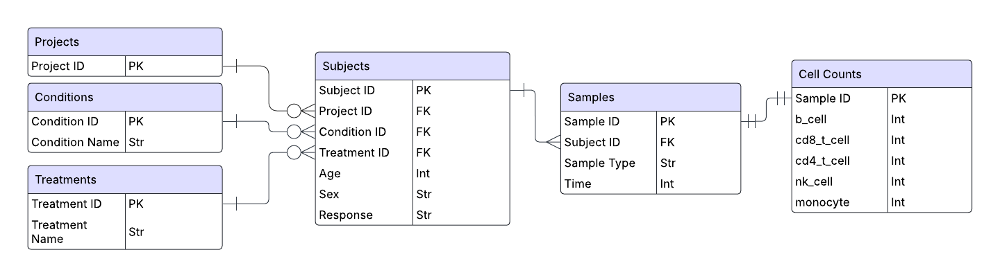

# ⚙️ Setup

Install requirements (Codespaces should do this for you):
```shell
pip install -r requirements.txt
```

Initialize SQLite DB:
```shell
python dashboard/database/create_db.py --csv-path dashboard/data/cell-count.csv --schema-path dashboard/database/init_db.sql --db-path dashboard/database/trial_data.db
```

To run the dashboard locally:
```shell
python dashboard/app.py --db-path dashboard/database/trial_data.db
```

# 🗂️ DB Schema




EDA of cell-count.csv revealed that no patient corresponded to multiple `projects`, `conditions`, or `treatments`. As a result, bridge tables to handle potential many-to-many relationships were omitted for simplicity.

Although `conditions` and `treatments` could have been represented as a simple string or enum field in the `subjects` table, decoupling these now makes it easier to extend them in the future, without too much additional complexity (e.g. if we wanted to add a 'dosage amount' column to `treatments`).

The `cell_counts` table is also decoupled from `samples` to separate sample metadata from quantitative measurements.

# Code Structure

This is a [Dash](https://dash.plotly.com/) web app for analyzing clinical trial cell count data, built with a pretty standard modular architecture, and written in Python. 

The code is organized into a few layers:

#### Database Layer (`database/`)
- Code to set up and load an SQLite database from `data/cell-count.csv`

#### Data Module (`data/`)
- SQL query logic and data transformation functions for specific use-cases

#### Stats Module (`stats/`)
- Mann-Whitney U tests for significance testing
- Chose MWU because it's a non-parametric test and cell population relative frequencies aren't going to be normally distributed

#### Presentation Layer (`layout/`, `plotting/`)
- `layout/` Defines UI layout, separated from application logic
- `plotting/` handles the generation of interactive figures

#### Application Entry Point (`app.py`)
- Main Dash app
- Orchestrates other components


# Dashboard Preview Link

[https://ominous-space-telegram-qg97qx9jxq9f9rv6-8050.app.github.dev/](https://ominous-space-telegram-qg97qx9jxq9f9rv6-8050.app.github.dev/)